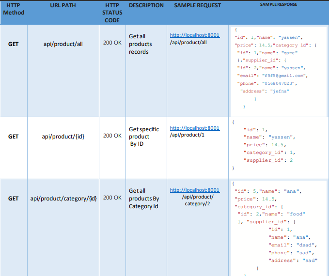
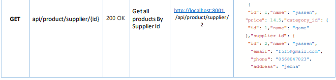
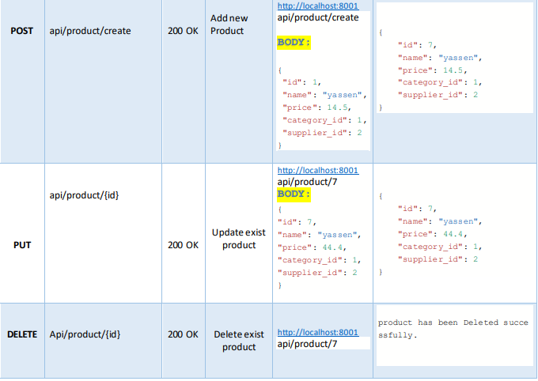

#Assignment 1 web Services 

** I created this Spring Boot application using a three-tier architecture (Controller, Service , JPA Repository)

** I built 3 Entities (Product, Supplier, Category)

** Controller to receive the APIs, describe their types, and submit them to the service

** Service, to handle any logic and make API calls to the repository

** CRepository to manage my database

** APIs Design And Responses 

